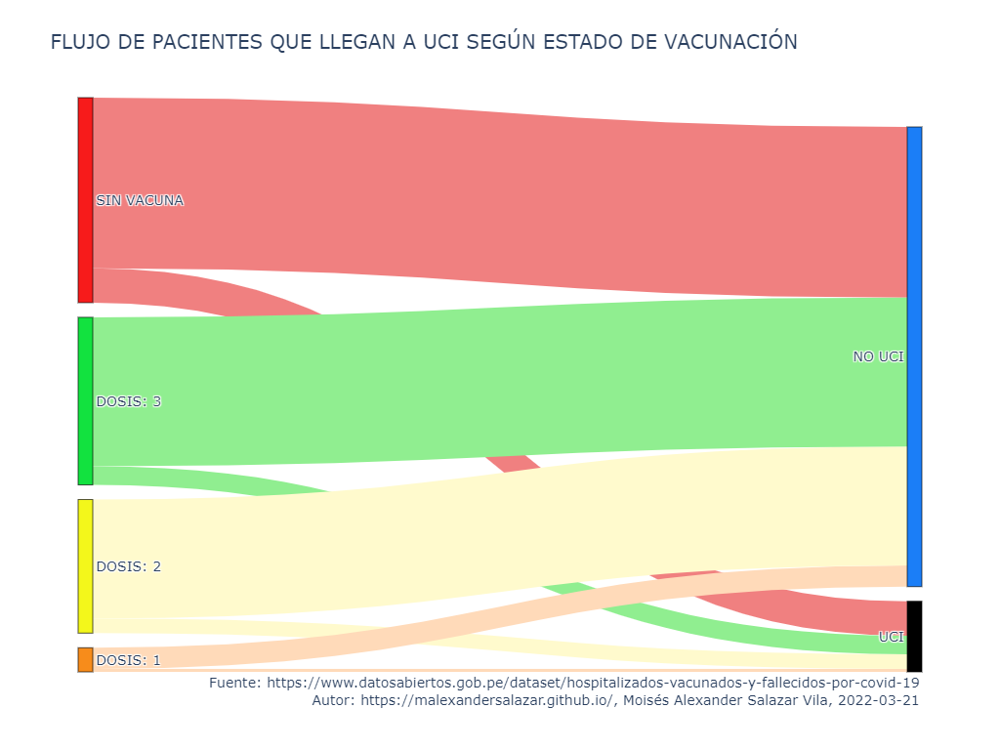
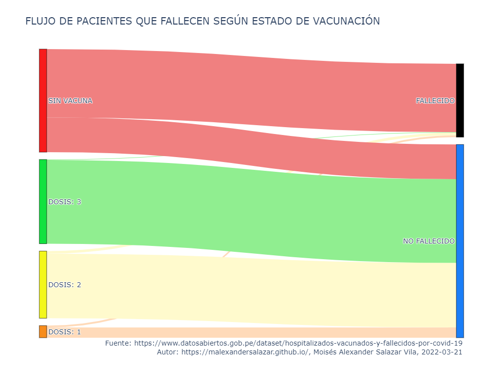

# Gráficos del flujo de pacientes por COVID-19 para verificar el efecto protector de las vacunas en Perú

## Antecedentes

Ya ha pasado un año desde el inicio la Campaña Nacional de Vacunación "Pongo el hombro por el Perú" con la llegada del primer lote de vacunas, pero si bien la llegada de las vacunas trajeron esperanza, también han habido serias complicaciones durante el proceso. 

El escándalo del Vacunagate, manifestaciones antivacunas promovidas por funcionarios o ex-funcionarios públicos [[1]], mafias dentro del sistema de salud público [[2]], difusión de teorías conspirativas a través de internet y desinformación sobre las vacunas por parte de la oposición del gobierno de turno son solo algunas de ellas.

Esto ha conseguido generar desconfianza por parte de la población sobre la aplicación de las vacunas y el efecto protector que se promete según diversos sistemas de salud alrededor de todo el mundo.

## Proceso

Este proyecto se desarrolló en Python 3.8.5 usando los paquetes **pandas**, **sankey**, **plotly** y **datetime**.

### Adquisición de Datos

Los datos empleados en este proyecto se obtuvieron actualizados a la fecha **2022-03-21** de la Plataforma Nacional de Datos Abiertos del Gobierno de Perú. El conjunto de datos utilizado está disponible en el repositorio "Hospitalizados, vacunados y fallecidos por COVID-19" [[3]] del Ministerio de Salud.

## Resultados

| Observación | Conteo |
| --- | --- |
| No vacunados que llegaron a UCI | 8910 |
| No vacunados que no llegaron a UCI | 44257 |
| Vacunados que llegaron a UCI | 9398 |
| Vacunados que no llegaron a UCI | 74957 |

Los vacunados cuentan con 74957 pacientes que no llegaron a UCI, mientras que los no vacunados cuentan con 44257 pacientes que  no llegaron a UCI.

| Observación | Conteo |
| --- | --- |
| No vacunados que fallecieron | 35254 |
| No vacunados que no fallecieron | 17913 |
| Vacunados que fallecieron | 2567 |
| Vacunados que no fallecieron | 81788 |

Los vacunados cuentan con 2567 pacientes que fallecieron a causa del COVID-19, mientras que los no vacunados cuentan con 35254 pacientes que fallecieron a causa del COVID-19.

## Conclusiones

Los pacientes vacunados requieren con menor frecuencia atención en UCI frente a los no vacunados. **Por cada 100 no vacunados que no llegan a UCI, hay 169 vacunados que no llegan a UCI**.

Los pacientes no vacunados fallecen con mucha mayor frecuencia con respecto a los vacunados. **Por cada 100 vacunados que fallecen por el COVID-19, hay 1373 no vacunados que fallecen**.

## Recomendaciones

* Reforzar la campaña de vacunación a través de los casos de éxito del mismo proceso. Generar confianza a través de hechos y datos. 
* Tomar medidas más estrictas con respecto a los movimientos antivacunas. Establecer sanaciones penales para los promotores.

## Referencias

1. Catalina Quinto. (13 de diciembre de 2021). _Coronavirus en Perú: las acciones de los antivacunas ante las nuevas restricciones_. RPP Noticias. Recuperado el 21 de marzo de 2022 de https://rpp.pe/peru/actualidad/coronavirus-en-peru-las-acciones-de-los-antivacunas-ante-las-nuevas-restricciones-noticia-1374657

[1]: https://rpp.pe/peru/actualidad/coronavirus-en-peru-las-acciones-de-los-antivacunas-ante-las-nuevas-restricciones-noticia-1374657

2. Redacción Gestión. (17 de diciembre de 2021). _COVID-19: mafias de no vacunados, proyecto de ley a favor de antivacunas y medidas del Minsa_. Gestión. Recuperado el 21 de marzo de 2022 de https://gestion.pe/peru/covid-19-mafias-de-no-vacunados-proyecto-de-ley-a-favor-de-antivacunas-protestas-contra-el-carne-y-medidas-del-minsa-nndc-noticia

[2]: https://gestion.pe/peru/covid-19-mafias-de-no-vacunados-proyecto-de-ley-a-favor-de-antivacunas-protestas-contra-el-carne-y-medidas-del-minsa-nndc-noticia

3. Ministerio de Salud - MINSA. (s.f.). _Hospitalizados, vacunados y fallecidos por COVID-19 | Plataforma Nacional de Datos Abiertos_. Gobierno del Perú. Recuperado el 21 de marzo de 2022 de https://www.datosabiertos.gob.pe/dataset/hospitalizados-vacunados-y-fallecidos-por-covid-19

[3]: https://www.datosabiertos.gob.pe/dataset/hospitalizados-vacunados-y-fallecidos-por-covid-19

